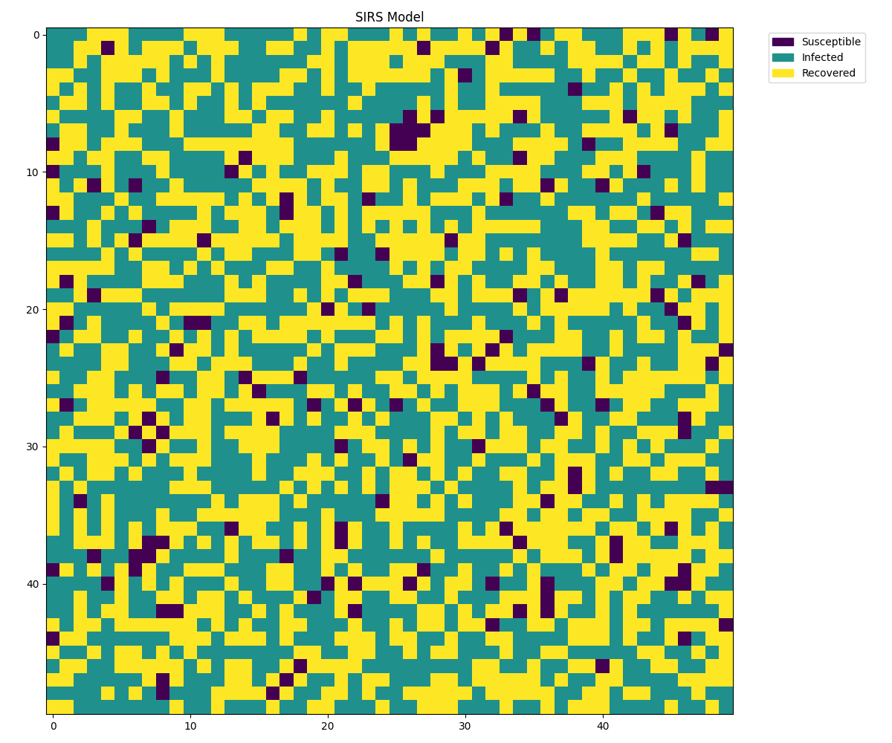
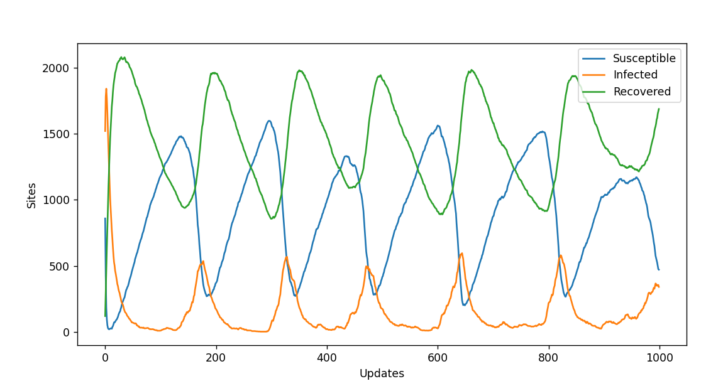
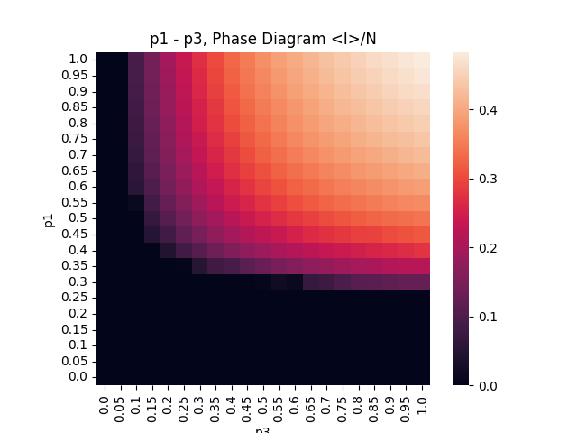
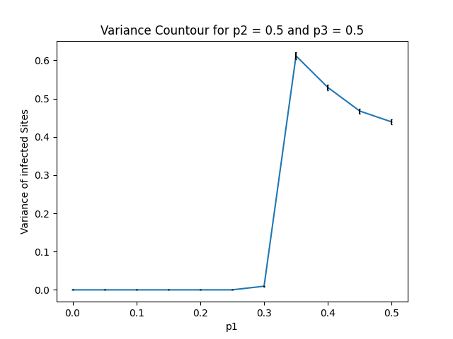
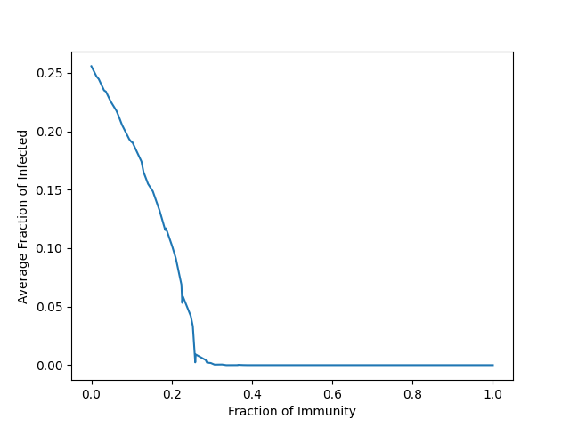

# Stochastic SIRS Model
Stochastic version of the Susceptible Infected Recovered Susceptible (SIRS) Model, where the update rules are identical to the deterministic Model but instead they are updated based on probability.


## Installation
Download the SIRS.py file and import the SIRS class.
```python
from SIRS import SIRS
```

## Usage
Define the probabilities for each transition. Susceptible to Infected (p1), Infected to Recovered (p2) and Recovered to Susceptible (p3).
```python
p1 = 0.8
p2 = 0.1
p3 = 0.01
```
Create an SIRS object.
```python
simulator = SIRS(size, p1, p2, p3, immune = False)
```
Run the simulation at the specified fps.
```python
fps = 60
simulator.simulate(fps)
```
## Results
Using the simulator and its methods, we can investigate properties of the Stochastic SIRS model.
In the Stochastic version, we have cyclic states where the number of infected sites varies very highly.



p1 - p3 Phase Diagram



Countour Diagram



We can also simulate a Stochastic SIR model instead by setting p3 = 0. In this case being recovered is equivalent to being immune. We can then investigate what initial fraction of immunity is required for there to be no infected sites at equilibrium. In the case for a 50 x 50 lattice, the minimum fraction of immunity is 0.2588.


